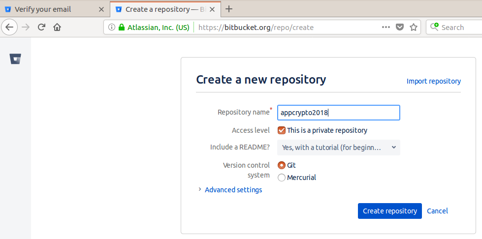
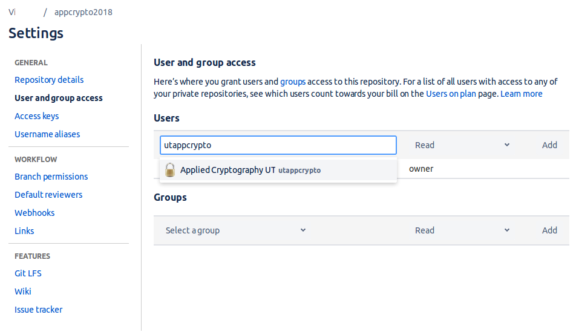

Setting up for course
=====================

Get yourself a Bitbucket account
--------------------------------

If not done already, [bitbucket.org](https://bitbucket.org/) and:

    Pricing > Free

Free Individual account is more than enough for this course.

Note that your username will be part of your repository URLs, so choose wisely.

Create code repository
----------------------

You will need to create a separate repository for this course.
Choose whatever name you like, for example, 'appcrypto2018'.

This repository must be private and must use Git version control.

Grant the user '**utappcrypto**' read access to your repository:

    Settings > User and group access

Type 'utappcrypto', click 'Add'.

If you want, you may revoke the access after you get your course grade.

Add your repository URL together with student ID to grading page at [https://cybersec.ee/appcrypto2018/](https://cybersec.ee/appcrypto2018/).

Start watching the course repository
-------------------------------------

Open the course repository page [https://bitbucket.org/appcrypto/2018/](https://bitbucket.org/appcrypto/2018/).

Click on the "Watch this repository" (the "eye" icon) on the right side of the course repository page.

Install Git client
------------------------

Command for Ubuntu:

    sudo apt-get install git

For other operating systems, find your way.

Learn how to use the client to perform basic operations.

Note that there are several GUI clients, but it is
strongly recommend *not* to use them until you get really comfortable with
command-line client and understand how it works.

Make your first commit
----------------------

Create a file called 'hello.txt' with the following content:

    My first commit

Commit and push to your repository.
Verify that it appears in the web interface under 'source' tab.

All done.

---

